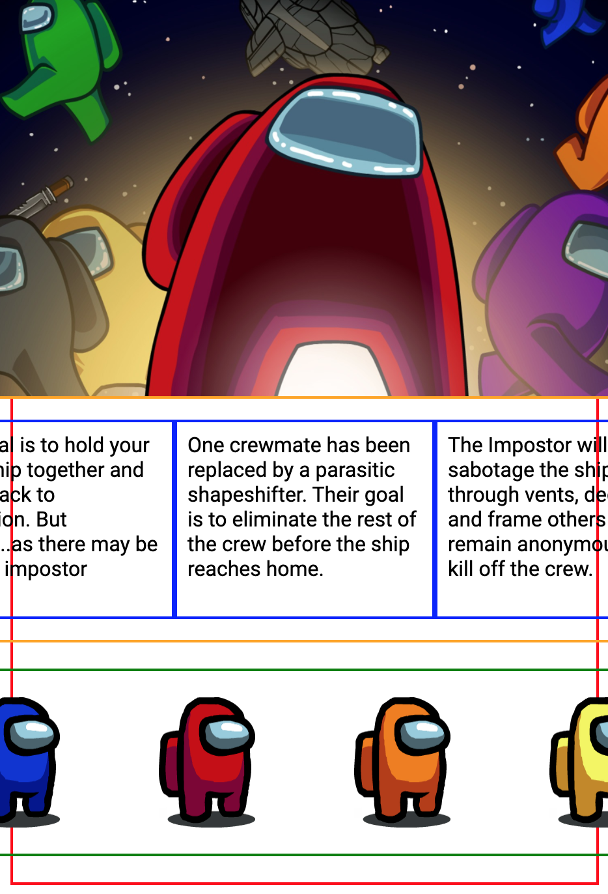
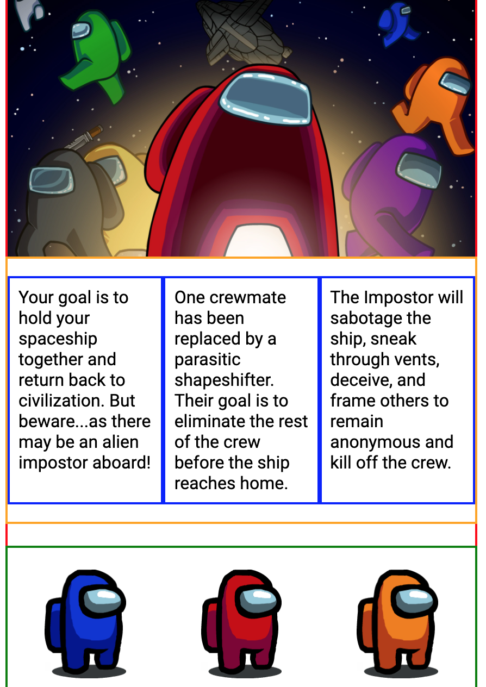

# Hackschool Session 6: Responsive Design and Accessibility

**Date**: November 18, 2020

**Location**: Zoom

**Teacher**: Kristie Lim ([@kristielim](https://github.com/kristielim))

## Resources

- [Slides](https://tinyurl.com/hackschool20-s6-slides)
- [ACM Membership Attendance Portal](http://members.uclaacm.com/login)

## What we'll be learning today

- [Hackschool Session 6: Responsive Design and Accessibility](#hackschool-session-6-responsive-design-and-accessibility)
  - [Resources](#resources)
  - [What we'll be learning today](#what-well-be-learning-today)
  - [Responsive Design](#responsive-design)
    - [Background](#background)
    - [Chrome Developer Tools](#chrome-developer-tools)
    - [Max Width](#max-width)
    - [Media queries](#media-queries)
    - [The Viewport Meta Tag](#the-viewport-meta-tag)
    - [Other Considerations](#other-considerations)
  - [Accessible Design](#accessible-design)
    - [Images](#images)

## Responsive Design

### Background

Responsive design means that your website is functional no matter the screen size. From [MDN](https://developer.mozilla.org/en-US/docs/Learn/CSS/CSS_layout/Responsive_Design), it is "a set of practices that allows web pages to alter their layout and appearance to suit different screen widths."

When we're first learning HTML/CSS, it makes a lot of sense to design websites for a desktop screen since that's what we're also using to develop the website. However, when you're building a website for a wide audience, a mobile-friendly design becomes extremely important. According to [Pew Research](https://www.pewresearch.org/internet/fact-sheet/mobile/), 1 in 5 American adults are "smartphone-only" users. And in the world, it's projected that nearly 3 in 4 people will use only mobile for Internet by 2025 ([CNBC](https://www.cnbc.com/2019/01/24/smartphones-72percent-of-people-will-use-only-mobile-for-internet-by-2025.html)). With the growing importance of mobile users, you might hear the phrase "mobile-first" design. This means that the website is primarily designed for a mobile screen then the desktop screen design is adapted around that rather than the other way around. Nowadays, it is difficult to find a website that doesn't have a mobile-friendly design. Even CCLE has a mobile-friendly design, so if you want your website to be at least as good as CCLE you gotta have one.

A responsive website does not come for free! If you've been working on your own website without checking how it looks on a small screen, it's unlikely that it will look good. In this workshop, we'll learn a few techniques to help give that _chef's kiss_ look to your website on mobile.

### Chrome Developer Tools

Check how your website looks like with Chrome Developer Tools! Right-click -> "Inspect Element" in order to open. There is a dropdown at the top where you can see how your site looks on different devices such as an iPhone, a Moto G4, or an iPad.


From this point forward, we will be using a simple website to demonstrate a couple ways to make your website more responsive. Download `demo-starter.zip` to get the code. This is how the website looks on desktop:


I added borders to get a better sense of where each element is in relation to each other.

However there are a lot of problems when we take a look at the website on mobile:


### Max Width

First, let's try to avoid having the cover image cut off on small screens. The cover image has a class of `cover` which we will use to refer in the CSS. One helpful CSS property is `max-width`. When we set it, the image can never become larger than the value given. In our starter site, the image `width` is set to 600px. If we set a `max-width` of `100%`. This means that the width of the image can never be more than 100% of the parent `div`. In this case, the parent `div` is shown in a red outline.

```css
.cover {
  width: 600px;
  max-width: 100%;
}
```

There are also more advanced techniques to even replace images upon detecting a smaller screen size. Here's a [tutorial from MDN](https://developer.mozilla.org/en-US/docs/Learn/HTML/Multimedia_and_embedding/Responsive_images).

Below the cover photo, there are two more elements that also extend past the screen size called `text-container` and `character-container`. Once we change those elements' `max-width` to `100%`, we can see that nothing extends past the edge of the screen anymore.



### Media queries

For more control over the styles when the screen size changes, we can use a CSS **media query**. A media query allows you to check what media or screen size is being used and then apply a different style according to the answer. Let's see some examples!

#### Changing the font size

First, this heading takes up about half of a small screen. I'd like to change the heading so that for small screens, the font size is smaller. Currently, the heading is 64px. Let's create a new media rule at the bottom of `styles.css`:

```css
@media screen and (max-width: 600px) {
  h1 {
    font-size: 42px;
  }
}
```

This says that for a screen that is at most 600 pixels wide, change the font size of heading 1's to be 42px instead. Now if we decrease the size of the screen to less than 600 pixels, the font size changes.

#### Changing the `display` value

I don't really like how squished the three columns of `text-container` look like on a small screen, so I'm going to get rid of the columns so that each paragraph is stacked on top of each other instead. Since the columns come from using `display: flex`, I can change the value to be `display: block` to get the stacked on top of each other behavior.

```css
@media screen and (max-width: 600px) {
  h1 {
    font-size: 42px;
  }
  .text-container {
    display: block;
  }
}
```

#### Changing from a four-column to a two-column layout

Lastly, I'd like the four columns of the `character-container` to change into two columns when I hit the breakpoint. From the starter code, each character's initial width is set to 25% of the parent:

```css
.character {
  flex: 25%;
}
```

> Note: `flex` is a property applied to items inside of a flex container. If a percentage is given, it will set the initial size of the item to be that percentage of its parent. The `flex` property is much more powerful than just that, and you can read more [from MDN here](https://developer.mozilla.org/en-US/docs/Web/CSS/flex).

In my media query, I can change the value to be 50% of the parent instead to give me 2 columns instead of 4:

```css
@media screen and (max-width: 600px) {
  h1 {
    font-size: 42px;
  }
  .text-container {
    display: block;
  }
  .character {
    flex: 50%;
  }
}
```

The website should now look like this:


### The Viewport Meta Tag

Viewing the previous changes on a smaller desktop screen seems to work! However, once you change to simulate a phone, it doesn't seem to work anymore??? You may have forgotten to add this magic line to the `<head>` section of your HTML.

```html
<meta name="viewport" content="width=device-width,initial-scale=1" />
```

By default on phones, mobile browsers will set the viewport width to 960 pixels and zoom out so you can see the whole screen as if it were on a desktop browser. This is a good enough experience when you don't have a mobile-friendly design, but we're striving for great not good enough here! When you do have a responsive design, you need to tell the browser to use the device width as the viewport width and to not scale aka `width=device-width,initial-scale=1` in code.

### Other Considerations

Hover interactions
Buttons are big enough to easily tap
Font is big enough to read on a phone
Simplify the layout

## Accessible Design

### Images

Don't use background image for meaningful images.

https://developer.mozilla.org/en-US/docs/Learn/CSS/CSS_layout/Responsive_Design
