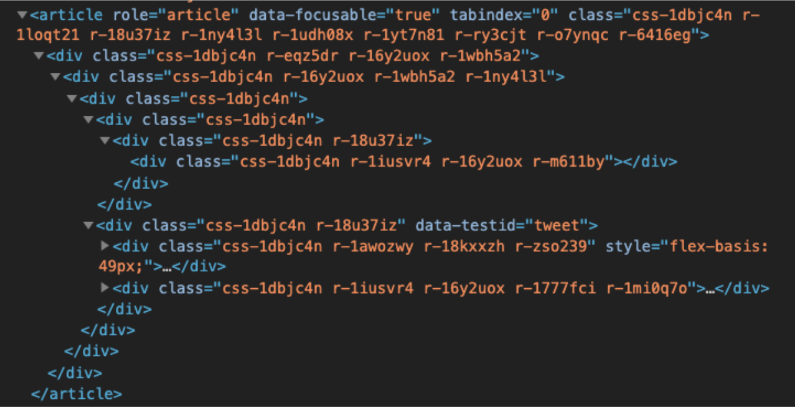
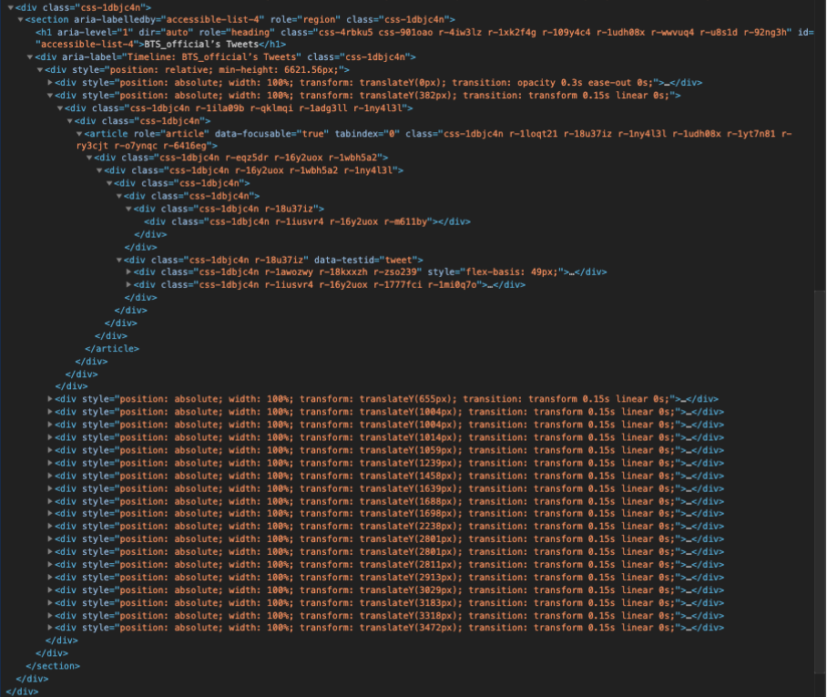
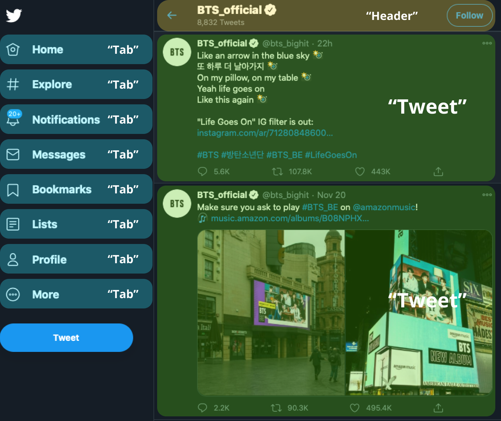
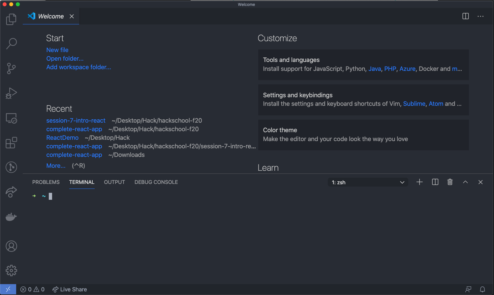
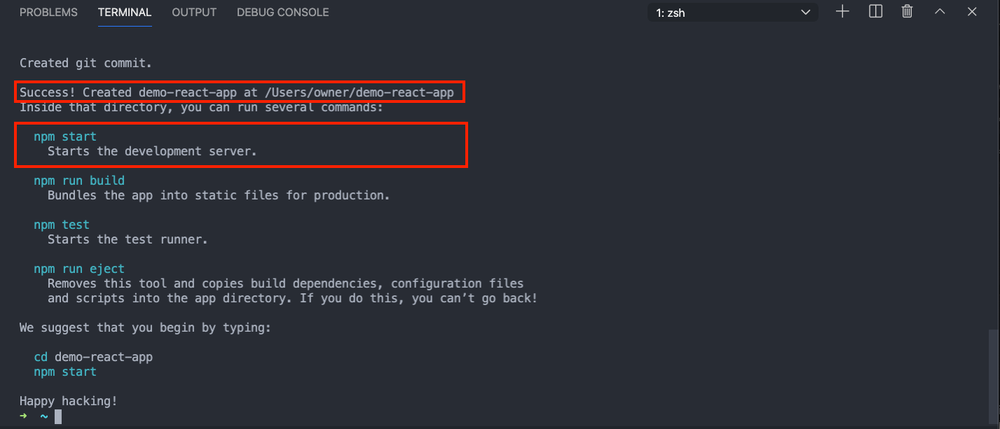
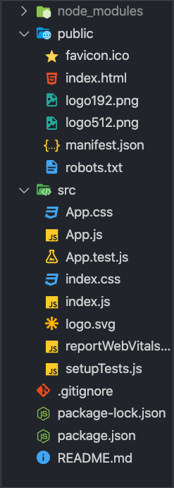
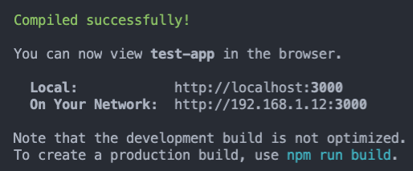
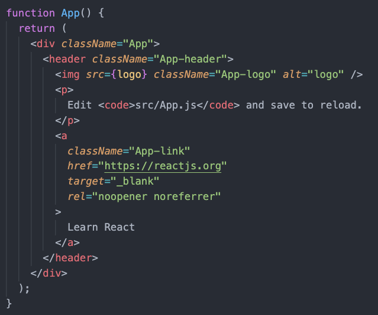
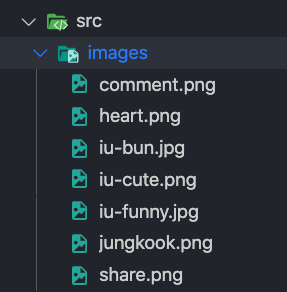
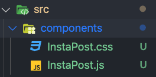

# Hackschool Session 7: Introduction to React.js

**Date**: November 25, 2020

**Location**: Zoom

**Teachers**: Eugene Lo, Jody Lin

## Resources

- [Slides](https://tinyurl.com/hackschool20-react-slides)
- [ACM Membership Attendance Portal](http://members.uclaacm.com/login)

## A Note About This Folder

This folder contains ["complete-react-app"](./complete-react-app), which **only** has the `public` and `src` folders of our completed React demo app. There are other folders required for React that we chose to delete because it takes up too much space in the folder. In order to have a fully functioning app of your own, you first **must** use the `npx create-react-app` command to create your own React app that generates all the necessary folders for you. Then, replace the `public` and `src` folders with the ones we have completed in "complete-react-app". Once all of this is set up, you should be able to successfully start the React app inside of "complete-react-app" using the `npm start` command (see more about this process [here](#setting-up-react)).

## What we'll be learning today

- [Background](#background)
- [Setting Up React](#setting-up-react)
- [Working with React](#working-with-react)
  - [What is JSX?](#what-is-jsx)
  - [Introducing Import/Export](#introducing-import/export)
  - [Rendering](#rendering)
- [Demo](#demo)
  - [Creating an InstaPost Component](#creating-an-instapost-component)
- [Props](#what-are-props?)
- [State](#state)
- [Challenges](#try-it-yourself:-challenges)

---

## Background

Welcome to the world of React! **React** is a tool that many web developers use in order to efficiently build their web pages. Before we dive into what exactly React is, though, let's take a detour to why exactly we should consider using a tool like React.

### Why Use React?

As a motivating example, let's take a look at the following profile on the Twitter website, which belongs to some indie, up-and-coming group that not too many people know about:


This web page looks pretty complicated! How exactly should we go about replicating this design? Well, let's first try to write the HTML for a single Tweet, which can look a little bit like this:



Looks complicated, right? But nothing that maybe 20-30 minutes of coding can't do!

... but Twitter isn't just made of only one Tweet... there's many, *many* more! In this case, would we just copy paste all of this code every time there's a new Tweet, and manually tweak the content of each to represent different Tweets? Then our HTML file would look something like this:



This *definitely* does not spark joy!! There is so much repeated code, which is a huge no-no in programming and makes our HTML file gigantic. Additionally, this requires a *ton* of manual work to update each Tweet's content ourselves. Keep in mind that I haven't even expanded the `div`'s towards the bottom of this screenshot, but if I did they would ALL look like our initial Tweet's HTML. If you need to take some deep breaths after this, I understand. You can go take a break on [r/EyeBleach](https://www.reddit.com/r/Eyebleach/) if needed.

There *must* be a better way to accomplish this task, right? All of our Tweets have the *exact* same structure, minus the content of the Tweet. If only there were some magic HTML element we can use, (something like `<Tweet />`), that creates the exact same structure for us behind the scenes, but saves us from having to copy paste huge chunks of code. We could also just pass properties into this magic HTML element, which would allow us to slightly tweak the content of each Tweet:

``` react
<Tweet
  name="Eugene"
  username="euglo"
  content="to fall asleep we first have to pretend we're asleep"
/>
```

In fact, this is *exactly* what a React component is, down to the syntax itself! Using React **components**, we can define bits of code that we can reuse over and over again! We can also pass it properties that it can directly display 🤯. 

If we go back to our Twitter web page, we may notice the usage of these reusable components. Each Tweet can be its own "Tweet component":


If we take the component idea even further, we may even notice that pretty much *all* of this page is components.



Each tab on the left bar is its own "Tab" component, with an icon to represent what the tab is for, and the title of the tab. Additionally, every profile on Twitter has a "Header" component, with the Twitter user's username, a Follow button, and how many Tweets they have made. 

If we expand on the "Tweet" component even further, we may be able to pick out even more possibilities of what can be components:


Each Tweet can have a "Profile Pic" component that contains the profile picture for the user making the Tweet, a "User" component with all the relevant user info, a "Content" component that contains the actual content of the Tweet (which may include image attachments), an "Icons" component that has the like, re-tweet, and like functionalities, and an "Options" component that opens a submenu with more actions the user can take on this Tweet. What this demonstrates is that components can be used to make *other* components. Overall, by using React, we are able to use reusable components as our fundamental basic building blocks to construct truly rich and complex user interfaces (UI), which is a really powerful idea.

### What is React?

With all this established, let's finally take a look at what React actually is. **React**, as mentioned previously, is a JavaScript tool for building rich user interfaces (UI) in an efficient manner. React was developed at Facebook by engineers who wanted to make our lives easier. Initially created as a tool within only the Facebook Ads team back in 2011, it has since boomed in popularity, becoming one of the hottest web tools currently being used. As we've seen, the core idea of React is reusable code through **components**, which are compilations of HTML-like elements that you can use over and over again (we'll take a look at why they are HTML-*like* and not exactly HTML in the [JSX section](#what-is-jsx).) With the power of React, we are able to create rich and interactive UI that automatically updates every time something inside the component changes (see [state](#state)). React will also only update the *individual* component that needs changing, thereby avoiding the need to refresh the entire page, which is the case without React. All of this combined makes for rich, highly efficient web apps for our users. For more information, feel free to check out the [official React website](https://reactjs.org)!

Currently, React is being used by *over 1300 developers* and *over 94,000 websites*, which includes companies like Reddit, Twitter, Facebook, Netflix, and Khan Academy - basically the starter kit for every college student!


On top of this, a survey was done on over 60,000 job postings on [Indeed.com](https://www.indeed.com). It turns out that *over 78.1%* of recruiters are actively looking for candidates with experience in React, while only 21% percent and 0.8% are looking respectively for [Angular](https://www.indeed.com) and [Vue.js](https://vuejs.org), which are two other tools for building webpages. The main takeaway for this section is that even though you may not be working on websites for all of your life, it is *still* something that's definitely worth your time to learn.

## Setting Up React

Let's go ahead and make our first React app! Before we do that, though, we should first cover a program we need to create it - the terminal!

The **terminal** provides us with an interface to accomplish tasks on the computer purely through text, and without a *graphical user interface* (GUI). The graphical user interface is the interface you're used to from day-to-day usage of a computer, where you're able to interact with the computer by pointing and clicking on graphical icons. On the terminal, we are able to perform the tasks we were able to using a GUI (and more) by running specific **commands**. If you want to know more about what we can do with terminals, feel free to check out a [previous workshop](https://tinyurl.com/tooling-3) Hack has done for Tooling Series, which has an entire section dedicated to them! For Mac and Linux users, there is a pre-downloaded "Terminal" app already available. For Windows users, we recommend using Powershell, but there are some nifty alternatives, such as the [Ubuntu terminal](https://ubuntu.com/tutorials/ubuntu-on-windows#1-overview) and [git for Windows](https://gitforwindows.org/).

One way to open up the terminal - and the way I'll be using here - is through VS Code. After you open a new window in VS Code (**File** -> **New Window**), go to  the toolbar and click **Terminal** -> **New Terminal**, which should open a terminal within VS Code like so:



In order to create a React app, we'll need to run one specific command: `npx create-react-app <app_name>`, where `<app_name>` is replaced by whatever you want to name your React app. Running this command will create a folder (your React app), which contains all the necessary files and folders automatically set up for you to get started with React right away.

Note: in order to run this command, you must first have Node.js installed. You can find the installation link [here](https://nodejs.org/en/). We recommend downloading the LTS version, which stands for long-term support. This is the more stable version, so you're less likely to run into bugs that may be present in the latest version.

For the purposes of this workshop, let's name our React app "demo-react-app". In this case, the respective command we would then write in our terminal is `npx create-react-app demo-react-app`code that React depends on before React itself can be installed. A bunch of files and folders will also be set up for us already, for our convenience, and this takes some additional time. Here's the screen you should see if everything has been installed successfully:



You'll notice that it has given us some useful commands to use when working with our React app. For the purposes of this workshop, the only important command to remember is `npm start`, which starts the "development server". The development server is a coding environment that React apps can be developed in, and it provides us with some neat conveniences as opposed to having to constantly save and refresh the web page when working with websites. We'll see a little more about this when we get to the [working with React](#working-with-react) section.

You'll also notice that it tells me that it has created "demo-react-app" at /Users/owner/demo-react-app (which will probably say a different file location for you). Let's go ahead and open this in VS Code by going to **File** -> **Open** (or just "Open folder" on the VS Code home window), and opening the location of your "demo-react-app".

If we expand out the `public` and `src` files that `npm create-react-app` has set up for us, we'll see that it has left us a handful of treats:



Let's start exploring this!

## Working with React

First things first, let's run `npm start` to start our development server. If everything is successful, you should see your terminal show this:



This starts our development server! It may seem like your terminal is just hanging there indefinitely, but this just means that your server is up and running. If you want to exit the development server at any point, just hit Ctrl+C on your keyboard (for Mac, Windows, AND Linux users).

If you save your file right now, you may see the terminal automatically update and compile again with a "Compiling..." message. This is the magic of development servers! Development servers are able to automatically save and update your app every time it notices that you save. This saves (no pun intended) a lot of time, especially when compared to having to manually refresh your web page every time you saved your file when working with normal HTML.

Let's continue our journey in `App.js` in the `src` folder. Immediately, we're greeted with this strange-looking JavaScript function:



This is actually a React component - a **functional component**, to be precise! It is defined just like any normal JavaScript, with the `function` keyword. The name of the component defines how we will use it, and it is capitalized out of convention. You may have encountered another way of definining components in React before, which are through [class components](https://reactjs.org/docs/components-and-props.html). Both of these definitions effectively accomplish the same thing, but we'll stick with functional components for the purpose of this workshop.

There's still a huge question left unanswered, though - if this is a normal JavaScript function, how in the world is it returning HTML?? Is this actually a string?? Actually, it's something new that's used in React - **JSX**!

Note: You may be confused by why we are using `className` instead of `class` for the class attribute, as it would be in vanilla HTML. Keep in mind, though, that this is JSX, and not actual HTML. The real reason for why we use `className` is because `class` is a reserved word for HTML, and thus cannot refer to styles on React elements.

### What is JSX?

**JSX** , which is used in React, *extends* the base syntax of JavaScript to allow us to write JavaScript code that *look* like HTML elements, but actually aren't.  Essentially, JSX is used to *describe* what the UI should look like to React, and React takes care of the rest. One point of distinction is that JSX produces **React elements**, not HTML. Behind the scenes, these HTML-looking lines get translated by React into a series of JavaScript code that manipulates the DOM to look like what the JSX describes. If you're interested in learning how React accomplishes this, feel free to read more into how React looks like [without JSX](https://reactjs.org/docs/react-without-jsx.html).

JSX can be stored into variables, or returned from functions, just like any other data in JavaScript. As a result, the following line is completely valid:

``` JSX
const element = <h1>Jody is great</h1>;
```

With JSX, we are also able to directly *insert* JavaScript expressions into our JSX, using *curly braces* { }:

``` jsx
const name = 'Eugene';
const element = <h1>{name} is great</h1>;
```

The result of `element` is  now "Eugene is great", which is a little bit more like it :) .

Because the curly braces can take in *any* JavaScript expression, this means they aren't restricted to just strings. The following lines of code would produce "7 is great":

```  jsx
const num = 2 + 5;
const element = <h1>{num} is great</h1>;
```

And the following *function* would work as well, producing "Eugene is great" again:

``` jsx
const nameFunc = () => {
  return 'Eugene';
};

const element = <h1>{nameFunc()} is great</h1>
```

All in all, JSX and its curly braces provide us with the expressiveness that we need for reusable components, because we are able to keep the overall structure of our React elements, while being able to slightly alter the content using curly braces.

### Introducing Import/Export

Now that we've dissected what the functional component `App` is doing in `App.js`, what exactly is being done? It gets defined, but it seems like nothing really gets done with it. In reality, though, it's getting *exported* out of the file in the bottom, using this line:

``` javascript
export default App;
```

This line introduces the concept of **importing** and **exporting**, which allows you to share functionality across multiple files! By functionality here, I'm referring to functions, classes, components, constants - basically anything that can be stored in a variable or returned from a function. Functionality that is *exported* in a file can be *imported* in another file entirely. For our `App` component, we can import in another file using the following syntax:

``` javascript
import App from './App.js';
```

where './App.js' is the file that we are importing from. One special thing about using `export default` is that we can exchange `App` for any other name. For example:

``` javascript
import Yeehaw from './App.js';
```

will also work as long as we are consistent with using `Yeehaw` throughout the file that is importing. The `default` keyword allows the importing file to understand that by default, `App` should be the functionality that is exported, meaning that any import statement will refer to `App` by default. For a more comprehensive look at import/export, check out [this article](https://javascript.info/import-export)!

Note: the `./` notation in front of the files is a special syntax to indicate that the file we are importing is in the same folder as the current file we are looking at.

Beyond exporting `App`, `App.js` is also doing some importing of its own at the top of the file:

``` javascript
import logo from './logo.svg';
import './App.css';
```

The first line is importing the logo image within the folder and storing it within a variable so that we can refer to it throughout the file. Since we won't be dealing with this logo in this demo, you can actually go ahead and delete that line. The second line is importing the CSS file associated with `App.js`, which is `App.css`. With this addition, all the style rules declared in `App.css` will be applied in this file.

Importing and exporting allows for much better code organization in the long run. Each file can only concern itself with one single concept, without having to concern itself with how other files work. For us programmers, it also makes it so that we can give our files meaningful names that describe the entire file in a more understandable way, which makes navigating all the files easier.

### Rendering

You may be wondering now, "What file is importing `App.js` then?" The answer is `index.js`, which is also in `src`. These are the imports that `index.js` performs at the top:

``` javascript
import React from 'react';
import ReactDOM from 'react-dom';
import './index.css';
import App from './App';
import reportWebVitals from './reportWebVitals';
```

In order to simplify this app a little bit, we're going to go ahead and delete the line that imports './index.css', and only work with the `App.css` CSS file. Now that we are also no longer working with `index.css` in any file, we can safely go ahead and delete the file itself now. Let's also clear out all the style rules inside `App.css`, so that all the styles we're working with are our own styles.

You'll also notice an import of the `reportWebVitals` function, which is later used in `index.js` :

``` jsx
// If you want to start measuring performance in your app, pass a function
// to log results (for example: reportWebVitals(console.log))
// or send to an analytics endpoint. Learn more: https://bit.ly/CRA-vitals
reportWebVitals();
```

If you open up `reportWebVitals.js`, you'll notice some confusing code, but the basic idea is that it is running some performance metrics on top of the React app. This may be important if you want to test how efficient your React app is, but this is beyond the scope of this workshop, so we can delete this `import` line and the function call to `reportWebVitals()`.

Now, our simplified import block will look like this:

``` jsx
import React from 'react';
import ReactDOM from 'react-dom';
import App from './App';
```

It imports in `App` in order to use it, as expected. In addition to this, however, it's also importing `React` and `ReactDOM` from specific JavaScript *libraries* - compilations of code that other programmers have written for us to use. `npx create-react-app` has already taken care of installing these libraries, so all we have to do as programmers is add those two lines to get our React app to work.

It makes sense as to why we need to import `React`, but what is `ReactDOM`?. In general terms, `ReactDOM` is responsible for *rendering* our React elements, as it does in `index.js` as such:

``` jsx
ReactDOM.render(
  <React.StrictMode>
    <App />
  </React.StrictMode>,
  document.getElementById('root')
);
```

<App />, by the way, is how we use our React components, as opposed to a normal function call, which would look more like `App()`.

Note: `React.StrictMode` is a component provided by React that helps you write better components by verifying the components within it do not have any potential risks, as well as if they are following recommended practices and are using up-to-date functionality.

**Rendering** is the process by which React takes all of the components and JSX we write in code, and translates them into manipulations of the DOM via JavaScript, so that we are able to visibly see them on our web page. The first parameter it takes is the component you want to render, and the second parameter is the HTML element you want React to start rendering on, otherwise known as the **"root" DOM node**. If you recall our [workshop on the DOM]([**tinyurl.com/hackschool20-s3-slides**](http://tinyurl.com/hackschool20-s3-slides)), `document.getElementById('root')` is obtaining a reference to an HTML element with id of "root". For this to work, though, we need to specify an actual HTML element with this ID - and this is located in the `index.html` file in the `public` folder!

``` html
<body>
    <noscript>You need to enable JavaScript to run this app.</noscript>
    <div id="root"></div>
    <!--
      This HTML file is a template.
      If you open it directly in the browser, you will see an empty page.

      You can add webfonts, meta tags, or analytics to this file.
      The build step will place the bundled scripts into the <body> tag.

      To begin the development, run `npm start` or `yarn start`.
      To create a production bundle, use `npm run build` or `yarn build`.
    -->
</body>
```

Once this HTML root node is displayed on the web page, React will then start running the JavaScript DOM manipulations necessary to render all of our React elements on top of this root node, so that it looks just like what the JSX structure looks like. In addition to rendering the topmost component (what is passed into `ReactDOM.render()`), all of the components that the topmost component contains in its structure will be rendered, and so on.

## Demo

With all of the basic React syntax out of the way, we can start working on the cool stuff - making an Instagram clone! For legal reasons, we can't exactly call it Instagram, though, so let's call it... uh... Insta**scam**.

This is an example of a post we would want to make:


This, by the way, is Jungkook, one of the members of BTS. I swear I only listen to them for their music.

If you want to follow along, make sure to get all of the necessary images we'll be using in the demo from the `images` folder in `src` from our ["complete-react-app"](./complete-react-app). These will be used later on!



### Creating an InstaPost Component

The first component that should come to mind is a component for a single Instascam post, which we will call `InstaPost`. Let's go ahead and make a new JavaScript file for our `InstaPost` component, named `InstaPost.js` (note that it's common convention to name the file the name of the component). Let's also make a corresponding CSS file to apply styles to our component and name it `InstaPost.css`. Finally, let's put both of these files in a dedicated `components` folder we create inside `src`, so that we're cool programmers who organize their code 😎. The resulting new files and `components` should look like this:



First things first: let's link React, as well as our CSS file into `InstaPost.js` so that all future styles are applied, using an *import* statement:

``` javascript
import React from 'react';
import './InstaPost.css';
```

Now, let's create our `InstaPost` component using *functional components*. For now, let's have it return an empty `<div>` with some basic styling.

`InstaPost.js`:

``` jsx
function InstaPost() {
  return <div className="post"></div>;
}
```

`InstaPost.css`:

``` css
.post {
  font-family: 'Segoe UI', sans-serif;
  max-width: 300px;
  border: 1px solid black;
}
```

Again, we use `className` instead of `class` because the `class` attribute is only usable by pure HTML elements, and thus is off-limits for JSX.

Next, let's make our `InstaPost` component available to the outside world with an `export` line at the bottom of `InstaPost.js`:

``` jsx
export default InstaPost;
```

With this, we've established the basic outline of our `InstaPost.js` file! We can now go ahead and continue fleshing out our Instascam post. First up is the top bar, which will contain the username of the poster:

`InstaPost.js`:

``` jsx
function InstaPost() {
  return <div className='post'>
    <div className='account-line'>
      <strong>eug.lo</strong>
    </div>
  </div>
}
```

`InstaPost.css`:

``` css
.account-line {
  padding: 8px;
}
```

... and yes, this is my real Instagram username. Wanna follow for follow?

Next up is the image, which we need to first import from the `images` folder to be able to use it in this file. 

Add this import line to the top group of imports in `IndexPost.js`:

``` jsx
import React from 'react';
import './InstaPost.css';
import jungkook from '../images/jungkook.png'; // add this line!
```

Notes: the `../` notation in the new import line indicates that the folder we are looking for is the folder *outside* the current file, aka the one that contains it. Since we are currently in the `components` folder, we must first leave this folder using `../` before we can enter the `images` folder, which is at the same level as `components`.

`InstaPost.js`:

``` jsx
function InstaPost() {
  return <div className='post'>
    <div className='account-line'>
      <strong>{props.accountName}</strong>
    </div>
    
}
```

(Recall that curly braces {} are used to directly insert JavaScript expressions into JSX.)

`InstaPost.css`:

``` css
.post > img {
  width: 100%;
}
```

Finally, let's finish up our icons (like, comment, share), our like count message, and our caption! First, we have to import these icons from the `images` folder:

``` jsx
import React from 'react';
import './InstaPost.css';
import jungkook from '../images/jungkook.png';
// add these lines
import heart from '../images/heart.png';
import comment from '../images/comment.png';
import share from '../images/share.png';
```

Our final `InstaPost` component, along with styling, should look something like this:

`InstaPost.js`:

``` jsx
function InstaPost() {
    return <div className='post'>
    <div className='account-line'>
      <strong>{props.accountName}</strong>
    </div>
    
    <div className='post-info'>
      <div className='icons'>
        
        
        
      </div>
      <div>
        0 likes
      </div>
    </div>
  </div>
}
```

0 likes, just like my real Instagram posts :~(

`InstaPost.css`:

``` css
.post {
  font-family: 'Segoe UI', sans-serif;
  max-width: 300px;
  border: 1px solid black;
}

.account-line {
  padding: 8px;
}

.post > img {
  width: 100%;
}

.post-info {
  padding: 4px;
}

.icons {
  display: inline-block;
}

.icon {
  display: inline;
  width: 30px;
  padding: 4px;
}
```

Assuming everything has compiled successfully up to this point, the last thing we have to do is have our `InstaPost` component rendered. We can do this by importing it into `App.js` and adding it as a component inside of the `App` component:

`App.js`:

``` jsx
import './App.css';

import InstaPost from './components/InstaPost';

function App() {
  return (
    <div className="App">
      <InstaPost />
    </div>
  );
}
```

Once everything is saved, the result should look something like the final result image we had [here](#final-result-img).

Let's slightly update the style on our "App" `<div>` element, so that our posts look more like an Insta~~gram~~ scam feed:

``` css
.App {
  width: 100%;
  display: flex;
  flex-direction: column;
  align-items: center;
}
```

Let's also reuse our component and show off the beauty of React!

``` jsx
import './App.css';

import InstaPost from './components/InstaPost'; // add this line

function App() {
  return (
    <div className="App">
      <InstaPost />
      <InstaPost />
      <InstaPost />
      <InstaPost />
    </div>
  );
}
```

Once we save and refresh, it should start looking like a proper Instascam feed!


---

## Props

By now, we have learned how to create reusable function 
components with React! Unfortunately, all of our components
are the exact same. This is a little boring because we don't
really want to stare at a bunch of posts with the same photo
of Jungkook. How do I _customize_ each component to have
a different images, caption, and account name? In other words:

**Question:** _How we do customize each component to contain 
different information?_ 

**Answer:** We use props!

### What Are Props?

Every function component we define has a (not-so) secret
parameter that let's us pass information to the component
each time we use it. This parameter is called the `props`
parameter. 

```jsx
function Profile(props) {
    // component code here
    ...
}
```

We pass data to this `props` parameter like this.
```html
<Profile name='jieun' age={27}/>
```

In this example, `name` and `age` are each
a single prop. The `props` parameter in our function
will contain an _object_ that contains _both_ of them. It would
look something like this:

```js
props: {
    name: 'jieun',
    age: 27
}
```

Within our function we could access these prop values the
same way we would access any javascript object value!

```js
function Profile(props) {
    console.log(props.name);
    console.log(props.age);
    // more component code here
    ...
}
```
If we ran the page containing this component in the browswer, 
we'd see the following output in the console:
```
jieun
27
```

### Careful! A _gotcha_ to look out for
Often times we will use our prop data within HTML 
elements. For example 

```js
function Profile(props) {
    return <p>My name is props.name and I'm props.age years old </p>
}
```

But when you render this in your browser, you'll get this
rather disappointing component:


This is because `props.name` and `props.age` are being read
as literal text. To fix this, we just add some curly bois 
`{}`. 

```js
function Profile(props) {
    return <p>My name is {props.name} and I'm {props.age} years old </p>
}
```

By adding the `{}` around our variables, we indicate that this
chunk of text is meant to be intepreted as JSX, not literal 
text. 

After this fix, the prop renders as intended:


## Adding `props` to the InstaPost component
Let's add props to the InstaPost component we made earlier.

Here are the parts of the post we do not want hardcoded.
* account name
* image
* caption

Let's pass in some props so that our props object will look 
something like this:
```
props: {
    accountName: 'the account name',
    image: /* the image here */,
    caption: 'some caption here'
}
```

```html
function InstaPost(props) {
  return <div className='post'>
    <div className='account-line'>
      {/* Access account name here */}
      <strong>{props.accountName}</strong>
    </div>
    
    <div className='post-info'>
      ...
      <div>
        {/* Access account name and caption*/}
        <strong>{props.accountName}</strong> {props.caption}
      </div>
    </div>
  </div>
}
```

Back in App.js, we can now add multiple posts with 
unique data.
```jsx
import './App.css';
import InstaPost from './InstaPost';

/* import images we want to use*/
import iuWithBun from './images/iu-bun.jpg';
import iuCute from './images/iu-cute.png';
import iuFunny from './images/iu-funny.jpg';

function App() {
  return (
    <div className="App">
        <InstaPost 
            accountName='jowody_lin' 
            image={iuWithBun} 
            caption='steamed buns!'
        />
        <InstaPost
            accountName='not_jody8'
            image={iuCute}
            caption='why is she literally so perfect'
        />
        <InstaPost 
            accountName='defNotJody719'
            image={iuFunny}
            caption='<3 <3 <3'
        />
    </div>
  );
}
```
When we run our react app, we can see that each InstaPost
component now uses its own unique prop values!


### But can we simplify our code _even more_??? Yes!

Recall how we can use the `.map()` function to run
a for loop on an array. Rather than writing out 
the `InstaPost` component 3 times to put in prop
values, let's store our prop values in an object array.

```jsx
const posts = [
  {
    accountName: 'jowody_lin',
    image: iuWithBun,
    caption: 'steamed buns!'
  },
  {
    accountName: 'not_jody8',
    image: iuCute,
    caption: 'why is she literally so perfect'
  },
  {
    accountName: 'defNotJody719',
    image: iuFunny,
    caption: '<3 <3 <3'
  }
]
```

Then let's use `.map()` to iterate through these objects
and apply the props to `InstaPost` components.

```jsx
import './App.css';
import InstaPost from './InstaPost';
import iuWithBun from './images/iu-bun.jpg';
import iuCute from './images/iu-cute.png';
import iuFunny from './images/iu-funny.jpg';

const posts = [
  {
    accountName: 'jowody_lin',
    image: iuWithBun,
    caption: 'steamed buns!'
  },
  {
    accountName: 'not_jody8',
    image: iuCute,
    caption: 'why is she literally so perfect'
  },
  {
    accountName: 'defNotJody719',
    image: iuFunny,
    caption: '<3 <3 <3'
  }
];

function App() {
  return (
    <div className="App">
      {
        posts.map(post => { 
          return <InstaPost 
            accountName={post.accountName} 
            image={post.image} 
            caption={post.caption}
          />
        })
      }
    </div>
  );
}

export default App;
```
> Do not forget to add the curly bois { } around the function!!!

This looks all fine and dandy until you open up the console
and see the dreaded red warning message:


This message is telling us that each of our `InstaPost`
instances should have a unique `key` prop. To get
rid of this warning, we just add a unique `key` to
`InstaPost` component in the `.map()` function. 

```jsx
function App() {
  return (
    <div className="App">
      {
        posts.map(post => {
          return <InstaPost 
            accountName={post.accountName} 
            image={post.image} 
            caption={post.caption}
            /* assuming every caption is unique */
            key={post.caption}
          />
        })
      }
    </div>
  );
}
```

> There is a much more complex reason why React wants 
us to add the `key` prop, but it is out of scope of this
introductory workshop. If you are interested in reading more,
a thorough explanation can be found [here](https://reactjs.org/docs/reconciliation.html). 

### Other places to simplify code
Within `InstaPost.js` we have 3 icons that all have
a lot of repeated code. 
```html
<div className='icons'>
  
  
  
</div>
```

Let's practice using props and create a new component
just for icons.

Inside of `InstaPost.js` we can define an `Icon` component
for `InstaPost` to use. 
```js
function Icon(props){
  
        
}

function InstaPost(props) { ... }
```

Then within the `InstaPost` function, let's replace
each image tag with our new component.
```html
<div className='icons'>
  <Icon icon='heart' image={heart} />
  <Icon icon='comment' image={comment} />
  <Icon icon='share' image={share} />
</div>
```


**Code Checkpoint**: *phew* okay that was a lot. If you've made it so far, your code should look like this:

```jsx
// App.js
import './App.css';
import InstaPost from './InstaPost';
import iuWithBun from './images/iu-bun.jpg';
import iuCute from './images/iu-cute.png';
import iuFunny from './images/iu-funny.jpg';

const posts = [
  {
    accountName: 'jowody_lin',
    image: iuWithBun,
    caption: 'steamed buns!'
  },
  {
    accountName: 'not_jody8',
    image: iuCute,
    caption: 'why is she literally so perfect'
  },
  {
    accountName: 'defNotJody719',
    image: iuFunny,
    caption: '<3 <3 <3'
  }
];

function App() {
  return (
    <div className="App">
      {
        posts.map(post => {
          return <InstaPost 
            accountName={post.accountName} 
            image={post.image} 
            caption={post.caption}
            key={post.caption} 
          />
        })
      }
    </div>
  );
}
export default App;
```
```jsx
// InstaPost.js
import React from 'react';
import './InstaPost.css';

import heart from '../images/heart.png';
import comment from '../images/comment.png';
import share from '../images/share.png';

function Icon(props) {
  return 
}

function InstaPost(props) {

  return <div className='post'>
    <div className='account-line'>
      <strong>{props.accountName}</strong>
    </div>
    
    <div className='post-info'>
      <div className='icons'>
        <Icon icon='heart' image={heart} />
        <Icon icon='comment' image={comment} />
        <Icon icon='share' image={share} />
      </div>
      <div>
        0 likes
      </div>
      <div>
        <strong>{props.accountName}</strong> {props.caption}
      </div>
      <div className='comments'>
        {comments}
      </div>
    </div>
  </div>
}

export default InstaPost;
```

**Content Checkpoint**: Let's summarize what we have learned
about props.
* all function components have a `props` parameter
* props allow us to pass data from a parent component into a
child component
* all properties passed into a component will be stored
in the corresponding `props` object 

---
Our Instascam app is almost complete. However, one of the 
defining features of the real Instagram that we are copying
is that people can like posts and leave comments. 

This new feature means that _each instance_ of `<InstaPost />`
will have to update a like count and comment section on 
by itself. 

Let's start with incrementing the like count.

### A brief summary of your future if you try to do this with props

1. You create a new prop in your post array called `likeCount`
and initialize it to 0. 
    ```jsx
        const posts = [
        {
            accountName: 'jowody_lin',
            image: iuWithBun,
            caption: 'steamed buns!',
            likeCount: 0
        },
        {
            accountName: 'not_jody8',
            image: iuCute,
            caption: 'why is she literally so perfect',
            likeCount: 0
        },
        ...
        ];
    ```
1. Inside `InstaPost.js` you create a handler function
that increments `props.likeCount` by 1 every time the 
post image is clicked. You make sure this gets properly 
called. 
   
    ```jsx
    const incrementLikeCount = () => {
        props.likeCount += 1
    }
    ```
1. You compile run your code
1. Your page crashes and displays this terrifying error.
    
1. aaaaaaaahhhh??? (for approximately 7 seconds)
1. You realize the prop is "read-only", so you cannot change
it's value.
1. You change your code to store a copy of `props.likeCount`
and update that copy whenever the image is clicked. Something
like this:
    ```jsx
    let likeCountCopy = props.likeCount;
    const incrementLikeCount = () => {
        likeCountCopy += 1;
        // for debugging:
        console.log("incremented like count"); 
    }
    ...
    <div>Liked by {likeCountCopy} people </div>
    ```
1. You compile and run your code
1. You click the image and...
1. "Why isn't the number of likes changing?"
1. "Oh let's check the console to see if the function is 
being run!"
1. "What I see "incremented like count" printed out, so the
function is being run. 
1. You sit in confusion. 

<em>At this point, you realize you don't know enough to be able to solve this problem.</em>

The solution to this is to use something called `state`. This
is used for each individual instance of a component to 
keep track of its own data. 

> **Philosophy of Props:** Props actually shouldn't be used 
when you want to use *and* update/change the data for some 
component.
Props are just designed for parents to pass down information to child components. This information is not meant to be
altered or changed. If there is data for a component we
want to use *and* change, we should be using `state`. 

## State
`state` is data that a component can store and update. When
the `state` of a component is changed, React will
**re-render** the component so we can see the new
and updated value of `state`. 

To use `state` in our function component, we first must
import the `useState` function provided by React. 

```js
import React, { useState } from 'react';
```

Let's see how this is used.
```jsx
import React, { useState } from 'react';

function InstaPost(props) {
    const stateArray = useState(0);
    let likeCount = stateArray[0];
    let setLikeCount = stateArray[1];
...
```
Let's break this down. 

`useState` takes in a parameter that initializes the 
variable returned in the first item of the array. 

`useState` returns a 2 item-long array containing:
1. a variable containing our state data
2. a function that allows up to update that first 
state variable
    * this function takes a single function parameter (a
       callback). The return value of this callback will
       be what our `state` variable is updated to

In practice, no one really just saves the returned array 
in a single variable. We usually do something called 
*array destructuring* that allows us to *directly extract
the array values* and put them into variables. This is written
like this:

```jsx
import React, { useState } from 'react';

function InstaPost(props) {
    const [ likeCount, setLikeCount ] = useState(0);
...

```
> This is equivalent to the previous code block. 

In this example, we have set the `likeCount` state to 0. We
also have a function called `setLikeCount` that can be used
to set the the value of `likeCount`. 

Let's add a function that will increment `likeCount`
when we call it.

```jsx
function InstaPost(props) {
    const [ likeCount, setLikeCount ] = useState(0);

    const incrementLikeCount = () => {
      setLikeCount( likeCount + 1 );
    };
...
```

Let's break down this code. 

1. We defined a function called `incrementLikeCount` that 
takes in no parameters and just calls `setLikeCount`. 
1. `setLikeCount` takes in a single parameter to set
the value of `likeCount`. 

Now we just need to call this function every time the image
post is clicked. 

Previously during [Session 3](https://github.com/uclaacm/hackschool-f20/tree/main/session-3-dom-api) we learned that
we simply use the function `.addEventListener('click', incrementLikeCount)`. 

However, because this behavior is so common, in HTML there is
a built in `onClick` prop into _nearly every_ element.

The syntax looks like this:
```html
<LiterallyAnyElement onClick={theNameOfTheFunctionToCall} />
```

If we add this to our post image, we get this:


```jsx
function InstaPost(props) {
    const [ likeCount, setLikeCount ] = useState(0);

    const incrementLikeCount = () => {
      setLikeCount(likeCount + 1);
      // for debugging:
      console.log("incremented like count!");
    };
    return <div className='post'>
        ...
        
        ...
        /* use the state likeCount */
        <div>{likeCount} likes</div>
        ...
    </div>
}
```

When we click our images, we will see the like count
increasing now!


Let's quickly summarize what the code is doing here.

1. Every time the image is clicked, we call 
`incrementLikeCount`.
1. `incrementLikeCount` adds 1 to the current value of
`likeCount` by calling `setLikeCount`. 
1. React detects that the state of `likeCount` has changed
and **re-renders** the component, allowing us to see the
updated `likeCount` value. 

> **Note:** A few _gotchas_ about `useState`
> * it _can only_ be used _inside_ a function component
> * it must be at the top level of scope within the function
component. (aka you cannot put `useState` in an if block,
loop, etc.)

---
# Try it yourself: Challenges

## Challenge 1: Add image alt tags
Currentlly none of our post images have an alt tag. These
tags are necessary for better accessibility for screen readers.

Using `props`, add a prop that passes in a descriptive
alt tag for each image. 

## Challenge 2: Adding Comments
If you have understood what we've done so far, then here is a 
demo on how to add comments to each Instascam post. This will
involve using _both_ props and state. 
> If you
are still digesting the information, then **STOP HERE**. First
take some time to understand the basic usage of `props` and 
 `useState`. 
After that, come back to this section, which incorporates
a few extra concepts we have not taught before. 

**Sneak Peek:** After adding comments, our final product should like this:


Here is what we'll need to do:
* Create a `Comment` component so we can make multiple
 comments
* Add an input box with a 'Comment' button
* Create an empty array for comments (using `state`)
* Create a `Comment` component with the text in the
input box every time we click the 'Comment' button
* add the newly created `Comment` component to our existing
array of comments

First we'll make the `Comment` component:
```jsx
function Comment(props) {
    return <div>
        <strong>eug.lo </strong>{props.text}
    </div>
}
```

Then we'll add an input box to the bottom of our post
so users can type in comments.

```jsx
function InstaPost(props) {

    const [ likeCount, setLikeCount ] = useState(0);

    return <div className='post'>
        ...
        <div className='post-info'>
            ...
            <input type='text'/>
            <button>Comment</button>
        </div>
    </div>
}
```

At this point, our post should look like this:


Now let's add some code so that we can type in our 
`<input>` element.

First we need to store the state of the text being typed
into the `input` element.

```jsx
function InstaPost(props) {
    ...
    const [ inputText, setInputText ] = useState('');

    /* NEW FUNCTION */
    const updateInputBox = (event) => {
        setInputText(event.target.value)
    }
    ...

    return <div className='post'>
      ...
        {/* call function with onChange */}
        <input type='text' value={inputText} onChange={updateInputBox} />
        <button>Comment</button>
      ...
    </div>
}
```

Let's breakdown what is happening:
* `inputText` is a state storing what is currently in the
input box.
  * we continually set the text inside the input box with this
  `value={inputText}`
* `onChange` is another special built-in prop. It takes in
 a handler function that takes in 
a parameter holding event that triggered
the function. In this case, the event
is the user typing in letters to the input box. 
* `updateInputBox` takes the `event` and extracts where it came from with `event.target`. This will be equal to the
 `<input>` element.
* `event.target.value` gets us the value of the
text currently typed into the `<input>` box. 

After adding this, we should be able to type into the 
`<input>` box.

Now let's add a comment section to our component where
our `Comment`s will go. Let's also initialize and empty
array of comments using `useState`. 

```jsx
function InstaPost(props) {

    ...
    const [ inputText, setInputText ] = useState('');
    // create state for comments
    const [ comments, setComments ] = useState([]);
    ...

    return <div className='post'>
        ...
            {/* Add a comment section here*/}
            <div className='comments'>
                {comments}
            </div>
            <input type='text' value={inputText} onChange={updateInputBox}/>
            <button>Comment</button>
        ...
    </div>
}
```

Now let's add a handler to the button that will add
a comment to the comment array every time we click
'Submit'.

```jsx
function InstaPost(props) {
    // ...
    const [ inputText, setInputText ] = useState('');
    const [ comments, setComments ] = useState([]);
    // ...

    const addComment = () => {
        setComments([...comments, <Comment key={inputText} text={inputText} />]);
        setInputText('');
    }

    return <div className='post'>
        ...
            <div className='comments'>
                {comments}
            </div>
            <input type='text' value={inputText} onChange={updateInputBox}/>
            <button onClick={addComment}>Comment</button>
        ...
    </div>
}
```

Let's break down the `addComment` function:
* the new `<Comment />` is appended to the original `comments`
array.
  * note: the `...comments` is a special operator that says
  take all elements of the `comments` array and copy them here
* then reset the text in the `<input>` box to an empty string


Now we should have our working comment section!

The full code of `InstaPost.js` should now look like this:
```js
import React, { useState } from 'react';
import './InstaPost.css';

import heart from '../images/heart.png';
import comment from '../images/comment.png';
import share from '../images/share.png';

function Comment(props) {
  return <div>
    <strong>eug.lo </strong>{props.text}
  </div>
}

function Icon(props) {
  return 
}

function InstaPost(props) {
  
  const [ likeCount, setLikeCount ] = useState(0);
  const [ inputText, setInputText ] = useState('');
  const [ comments, setComments ] = useState([]);

  const incrementLikeCount = () => {
    console.log("Incrementing like count!")
    setLikeCount(likeCount + 1)
  }

  const updateInputBox = (event) => {
    setInputText(event.target.value)
  }

  const addComment = () => {
    if (inputText.trim() !== '') {
      setComments([...comments, <Comment key={inputText} text={inputText}/>]);
    }
    setInputText('');
  }

  return <div className='post'>
    <div className='account-line'>
      <strong>{props.accountName}</strong>
    </div>
    
    <div className='post-info'>
      <div className='icons'>
        <Icon icon='heart' image={heart} />
        <Icon icon='comment' image={comment} />
        <Icon icon='share' image={share} />
      </div>
      <div>
        {likeCount} likes
      </div>
      <div>
        <strong>{props.accountName}</strong> {props.caption}
      </div>
      <div className='comments'>
        {comments}
      </div>
      <input type='text' value={inputText} onChange={updateInputBox}/>
      <button onClick={addComment}>Comment</button>
    </div>
  </div>
}

export default InstaPost;
```

```js
// App.js
import './App.css';

import InstaPost from './components/InstaPost';

import jungkook from './images/jungkook.png'
import iuWithBun from './images/iu-bun.jpg';
import iuCute from './images/iu-cute.png';
import iuFunny from './images/iu-funny.jpg';

const posts = [
  {
    accountName: 'eug.lo',
    image: jungkook,
    caption: 'wow stan jungkook',
    altDescription: 'jungkook in a white hoodie'
  },
  {
    accountName: 'jowody_lin',
    image: iuWithBun,
    caption: 'steamed buns!',
    altDescription: 'IU holding a steamed bun'
  },
  {
    accountName: 'not_jody8',
    image: iuCute,
    caption: 'why is she literally so perfect',
    altDescription: 'IU in a green sweater'
  },
  {
    accountName: 'defNotJody719',
    image: iuFunny,
    caption: '<3 <3 <3',
    altDescription: 'IU making a funny face'
  }
]

function App() {
  return (
    <div className="App">
      {
        posts.map(post => {
          return <InstaPost 
            accountName={post.accountName} 
            image={post.image} 
            caption={post.caption}
            altDescription={post.altDescription}
            key={post.accountName} 
          />
        })
      }
    </div>
  );
}

export default App;
```

---
# More on React.js
If you are interested in learning more about React,
the official documentation is quite useful and has a fun
[tutorial](https://reactjs.org/tutorial/tutorial.html) to get you started coding. 
